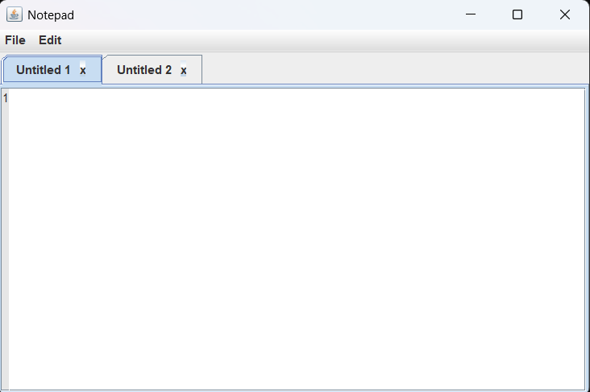
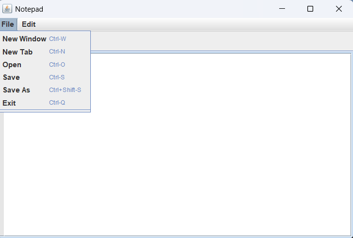
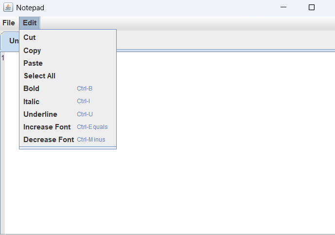

# Java Notepad Editor

Desktop-based text editor developed using Java Swing and AWT.

## Features
- Open files
- Save files
- Edit text
- Line number support

## Screenshots

### Main Editor

### File Feature

### Edit Feature

## Download
Download the runnable application from the Releases section.
